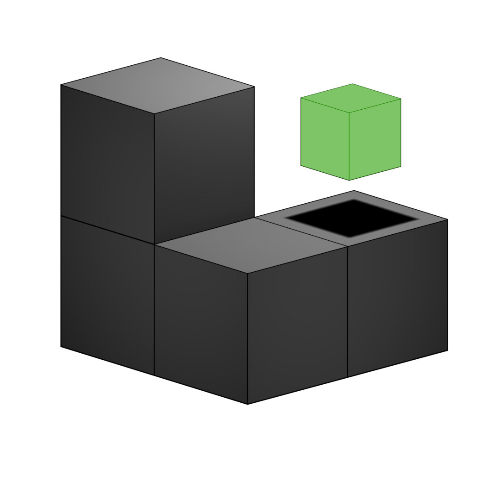

# SPECK

A tiny, data-oriented game engine layered on top of Three.js. Built to keep
~10k lightweight entities on screen at once.

Three.js and Rapier are **peer dependencies**, not bundled. The lib side-loads
alongside them.

## Module docs

This README covers architecture — what each piece *is* and how they fit
together. Each `src/` subdirectory has its own short `README.md` alongside
the code for the practical layer this one doesn't: best practices,
trade-offs, and gotchas specific to that part of the stack.

| Directory | Covers |
| --- | --- |
| [`src/core/`](src/core/README.md) | ECS core, `World`, `EventQueue`, `SpatialGrid`, `FixedStep`, `TweenRunner`, `Preloader`, `SimplexNoise` |
| [`src/components/`](src/components/README.md) | `TransformStore` |
| [`src/physics/`](src/physics/README.md) | `PhysicsSystem` (Rapier adapter) |
| [`src/rendering/`](src/rendering/README.md) | `InstancedRenderer`, `ParticleSystem`, `GltfLoader` |
| [`src/audio/`](src/audio/README.md) | `SoundSystem` |
| [`src/input/`](src/input/README.md) | `InputBuffer` |
| [`src/ai/`](src/ai/README.md) | Behavior trees, `AiState`/`createAiSystem`, flocking |
| [`src/debug/`](src/debug/README.md) | `DebugOverlay` |

## Architecture

1. **ECS core** — entities are generational integer handles (`Entity`). Component
   data lives in packed arrays addressed through a `SparseSet`, giving dense,
   cache-friendly iteration and stable identity. Removal is swap-remove, so
   arrays never develop holes and callers never reason about raw indices.
   - `ArrayComponentStore<T>` — for cold/heterogeneous components (a body handle, a type id).
   - `TransformStore` — the hot path: one interleaved `Float32Array` (stride 10:
     position, quaternion, scale) that a system streams straight through.
   - `EntityManager` also mints a stable random string id per entity
     (`idOf`/`entityOf`). This — not the raw `Entity` handle — is the id any
     manual or external interaction should hold: a level editor, a save file,
     a network message. The `Entity` handle packs a live slot index into its
     low bits, so constructing or persisting one by hand can point at the
     wrong (recycled) entity or corrupt engine bookkeeping outright. The
     string id is opaque and immune to that.
2. **Event queue** (`EventQueue`) — the causality layer. Systems `emit()`; `drain()`
   delivers to handlers. Cascades (a match → a removal → a settle) resolve within
   one tick, bounded by `maxPasses` so feedback loops can't hang. Deterministic order.
3. **Rendering + physics adapters**
   - `InstancedRenderer` — one `InstancedMesh` per visual type = one draw call per
     type. Also records instanceId → entity each frame so raycast picking resolves
     back to an entity (needed for drag-picking).
   - `ParticleSystem` — a basic particle burst effect, deliberately *not*
     entity-based: at the count and churn a particle burst implies (spawn
     dozens at once, dead within a second), the per-particle overhead a full
     `Entity`/`TransformStore` row buys you — stable identity, picking,
     component composition — is pure waste, since nothing ever looks a
     particle up by handle. One flat pool of typed arrays (position,
     velocity, life, color, alpha), rendered as a single `THREE.Points` — the
     same SoA call `TransformStore` makes, without the identity layer this
     doesn't need. `emit()` spawns (silently dropped past `capacity` — a
     fixed pool, not a growable queue); `update(dt)` integrates, fades alpha
     toward 0 over remaining life, and reaps dead particles via swap-remove
     so the live set stays packed at the front. Not driven by `World`/`step()`
     — call `update(dt)` yourself.

     Rendered with a small custom `ShaderMaterial` rather than stock
     `PointsMaterial`, specifically so the fade can be a real per-vertex
     alpha rather than darkening toward black — `PointsMaterial`'s
     `vertexColors` only ever reads RGB, with no per-particle alpha
     equivalent. Geometry attributes bind to shader `attribute`s by name
     automatically, so wiring up the custom `alpha` attribute is one
     declaration in the vertex shader; `vertexColors: true` on the material
     still gets `attribute vec3 color` auto-declared the same way any
     built-in material would. Circular, soft-edged points (one `discard` +
     `smoothstep` in the fragment shader) instead of flat square sprites,
     since that was nearly free once writing a shader anyway.
   - `PhysicsSystem` — wraps a Rapier world. Rapier owns simulation state; each tick
     it steps, then copies body transforms back into the SoA `TransformStore`.
     `removeBody(e)` removes the rigid body from Rapier — call it *before*
     `world.despawn(e)`, since despawn strips every registered store
     (including the body handle) as part of its generic sink cleanup; calling
     order the other way round leaves nothing to look the handle up with.
     `addStaticBox(position, half)` is a fixed collider anywhere — walls, a
     ceiling, any boundary; `addStaticGround` is just this specialized to a
     thin floor. `addDynamicBox` applies non-zero linear/angular damping by
     default — Rapier's own default is zero (no drag), which lets a dense
     pile of many bodies jitter on unstable resting contacts indefinitely
     with nothing to bleed that energy off, so they never fall asleep and
     stay in the solver's per-step working set forever.

     Every collider it creates has both `ActiveEvents.COLLISION_EVENTS` and
     `CONTACT_FORCE_EVENTS` on, at a configurable `contactForceThreshold`
     (default 40, one force unit above a single box's own resting weight —
     see the `addDynamicBox` doc comment for why that's a coarse floor, not a
     "this is a serious hit" cutoff). Three ways to read collision state
     back out, in increasing detail:
     - `drainCollisions(cb)` — call once per `update()` — delivers every
       collision-*start* pair from that step, each side resolved to the
       `Entity` that owns it where there is one (static geometry and
       anything already despawned resolve to `undefined`). Stop events are
       dropped: "began touching" is the useful signal for reactive effects
       (a bump sound), "stopped touching" rarely is.
     - `drainContactForces(cb)` — same shape, but delivers a force
       *magnitude* instead of just "touched," for pairs whose contact force
       crossed the per-collider threshold. Use it to scale a reactive effect
       by impact strength instead of firing it uniformly.
     - `contactsWith(e, cb)` / `contactBetween(a, b, cb)` — narrow-phase
       polls (not events; call when you need them, e.g. once per tick for
       entities a `SpatialGrid` query already narrowed down), giving the
       full contact manifold: per-contact-point positions, the shared
       contact normal, per-point impulses. Enough for bespoke response
       (sparks at the exact contact point, deflection based on normal) —
       not wired into anything in this engine or the example, a hook for
       projects that need more than "these touched" or "how hard."
4. **Spatial index** (`SpatialGrid`) — a uniform hash grid for neighbor queries
   (flocking, AI target acquisition, broad-phase). Register it with
   `world.registerSpatialGrid(grid, transforms)` and `World.step()` rebuilds it
   from `TransformStore` in one flat pass before systems run, so any system can
   call `grid.queryRadius(...)` for current-frame neighbors. Rebuilding instead
   of maintaining persistent state is what keeps it cheap for a fully-dynamic
   population — see "Why a grid, not a tree" below.
5. **AI** (`src/ai/`) — intentionally rudimentary boilerplate, meant to be
   overridden per project rather than used as-is:
   - `BehaviorNode<C>` (`behavior-tree.ts`) — a node is `(ctx: C) => 'success' |
     'failure' | 'running'`. `sequence`/`selector`/`invert` compose nodes;
     `action`/`condition` wrap plain functions. `C` is generic — define
     whatever context your project's nodes need. Add new node types (parallel,
     cooldowns, ...) the same way: another function of that same shape.
   - `AiState<B>` + `createAiSystem` (`ai-system.ts`) — a component storing a
     tree root and a blackboard (`B`, your per-entity memory shape), plus a
     system that ticks every entity's root once per frame. It does no
     scheduling or interruption; swap it for your own if you need that.
   - `separationCohesionSteer` (`flocking.ts`) — separation + cohesion only,
     built on `SpatialGrid`. Alignment is deliberately omitted (it needs a
     velocity component this engine doesn't ship) — a marked extension point,
     not an oversight. It's a plain function, not wired into `AiSystem`: call
     it from inside your own `action()` node.
6. **Debug overlay** (`DebugOverlay`, `src/debug/`) — a top-right `<div>`
   showing fps/frame time plus `world.entities.count` and per-store sizes
   (`World.storeSizes()`). Browser-only and opt-in: nothing runs unless you
   construct one, and nothing in `World`/`step()` knows it exists. Call
   `tick()` once per rendered frame; `destroy()` removes it. It's plain text
   in a `<div>`, not a stats framework — swap it for a graph/devtools panel by
   reading the same `storeSizes()`/`entities.count` introspection.
7. **Tweens** (`TweenRunner`, `tween.ts`) — short, self-contained timed
   animations (a match-combine flourish, a screen shake, a UI transition):
   `play({ duration, onUpdate(t), onComplete? })` where `t` is progress eased
   into `[0, 1]`. Not entity-specific — `onUpdate`'s closure captures whatever
   it needs to animate (entities via a component store, the camera, a DOM
   element), the runner only tracks progress/timing, so it doesn't need to be
   a `System` or own a store. Register with `world.registerTweenRunner(runner)`
   and `step()` advances it after events drain each tick (so a tween an event
   handler starts this frame gets its first tick this same frame, not one
   frame late) — or skip registration and call `update(dt)` yourself.
8. **Fixed-timestep loop** (`FixedStep`, `fixed-step.ts`) — decouples
   simulation from render rate. `advance(realDt, step)` accumulates real
   elapsed time and calls `step(fixedDt)` zero or more times at a fixed size,
   so `PhysicsSystem.update`/`World.step` (and anything timed against them,
   like a `TweenRunner` animation) run at a consistent rate regardless of
   display Hz, while rendering still happens once per `requestAnimationFrame`
   call. `maxStepsPerFrame` caps catch-up after a stall (a backgrounded tab, a
   GC pause) so a large `realDt` can't demand a burst of steps that itself
   blows the frame budget and falls further behind every subsequent frame —
   past the cap, the backlog is dropped instead. `alpha` (the fraction of a
   step banked but not yet simulated) is exposed for render interpolation,
   which this class supports but doesn't itself do — see the matching-game
   walkthrough below for the tradeoff of skipping that for now.
9. **Sound** (`SoundSystem`, `src/audio/`) — a minimal wrapper around
   `THREE.Audio`/`AudioListener`, handling the fiddly bits every consumer
   would otherwise redo: attaching a listener to the camera, resuming the
   `AudioContext` after the browser's autoplay policy suspends it until a user
   gesture, and *not distorting* once a lot of cues overlap. `load(url)`
   fetches+decodes a file into a reusable `AudioBuffer`; `play(buffer, {
   volume })` plays it as a non-positional cue. Not a mixing graph or spatial
   audio — `listener.context` is the raw `AudioContext` for anything past
   that. Buffers don't have to come from `load()`: synthesizing one directly
   (an `OscillatorNode` rendered to a buffer, say) works too, so a cue can
   need zero external assets — see the matching-game walkthrough.

   Web Audio just sums every connected source, so a burst of simultaneous
   plays (an AI spamming the same hit sound, several matches landing in one
   tick) can sum past `[-1, 1]` into audible clipping with nothing to stop
   it — a classic footgun that reads as "the audio breaks under load."
   `play()` goes through admission control rather than straight to playback,
   matching how most game audio engines handle this:
   - **Dedup.** `play(buffer, { id })` — a request sharing `id` with
     something already sounding *or* queued is dropped outright, not
     stacked. Omit `id` to never dedup a given cue.
   - **Priority.** `play(buffer, { priority })` (default 0, higher wins). At
     `maxVoices` capacity (default 12), a new request only plays by
     *stealing* the lowest-priority active voice, and only if it outranks
     it; otherwise it queues. Draining the queue as voices free up also goes
     highest-priority-first (ties keep FIFO order).
   - **TTL, enforced where it actually matters.** `play(buffer, {
     queueTTL })` (default 200) stamps the request with `requestedAt` at
     call time, but the check happens right before a voice actually
     starts — not just at intake — so it's a real "this never plays once
     it's this stale" guarantee, whether the request sat in the queue or
     briefly won/lost a voice-steal. A hit sound a full second after
     whatever caused it reads as broken, not merely late, so it's dropped
     silently instead. The queue itself is also capped (`maxQueueLength`,
     default 8), evicting the lowest-priority queued request to make room:
     TTL alone only bounds how stale any *one* request can be, not how many
     can be queued at once — without the cap too, a burst that outpaces
     `maxVoices` for its whole duration keeps the queue permanently full and
     trickles out stale-ish plays the entire time.
   - **Limiter.** A master `DynamicsCompressorNode`, wired in via
     `listener.setFilter`, sits on all listener output regardless of the
     above — catching the remaining case where a few voices under the cap
     still sum past clipping. On by default; `{ limiter: false }` opts out
     (e.g. for a project managing its own master bus via `listener.setFilter`,
     since that call replaces whatever filter is already set, including this one).
10. **Noise** (`SimplexNoise`, `fbm2D`/`fbm3D`, `poissonDiskSample2D`,
    `noise.ts`) — procedural generation primitives for terrain and
    placement. Three.js provides none of this. `SimplexNoise` is a seeded,
    dependency-free simplex implementation (2D + 3D); `fbm2D`/`fbm3D` layer
    it into fractal Brownian motion for terrain-like heightmaps and density
    fields. `poissonDiskSample2D` is a separate, unrelated technique for a
    related problem — evenly-spread ("blue noise") point placement (trees,
    rocks, spawn points) via Bridson's dart-throwing algorithm, rather than
    a raw random scatter, which clumps and leaves gaps at the same density.
    Everything here is seeded through `Rng`/`createRng` rather than
    `Math.random`, so terrain and placement are reproducible from a level
    seed. `examples/dynamic-lighting/logo-flight.js` uses both: `fbm2D` for
    its rolling terrain, `poissonDiskSample2D` for scattering sculptures
    across it. Correctness (not perf) is covered by `tests/noise/` — see
    Tests below.

## Why the packed layout

A `Map<Entity, {…}>` of objects is correct but scatters each entity across the
heap; iterating thousands of them every frame chases pointers and stalls the
cache. The interleaved `Float32Array` is contiguous, so the CPU streams
through it directly. The `SparseSet` sits on top purely for identity/packing
bookkeeping, providing stable `Entity` handles without exposing raw, fragile
array indices.

The payoff is specific to *many entities each doing cheap work* — the
pile-of-thousands case (the matching-game example runs `ITEM_COUNT = 3000`;
see its walkthrough below for why that number, not something larger, is what
currently runs smoothly with full Rapier physics on every entity). For
entities doing heavy work, a map is simpler and the cache-locality gains
don't matter as much.

## Why a grid, not a tree

`SpatialGrid` buckets entities into fixed-size cells (`Map<cellKey, Entity[]>`)
and rebuilds from scratch every tick, straight from `TransformStore.raw`. A
quadtree/octree adapts better to sparse or uneven worlds, but paying for that
adaptivity means pointer-heavy nodes that get inserted into, split, and
rebalanced — expensive to redo every frame when most or all entities move,
which is the common case for flocking/steering. A grid's rebuild is a single
O(n) pass with no node structure to maintain, and `queryRadius` is O(1)
average per cell, so it's the better default for a roughly-uniform, fully
dynamic population (a swarm, a level's active enemy set). It gets worse than a
tree over very large, mostly-empty worlds, where most cells sit unused — not a
concern at the engine's target scale, but worth reconsidering if the world
grows sparse.

## Run

```bash
npm install
npm run typecheck   # tsc --noEmit
npm run build       # emits dist/speck.js + dist/**/*.d.ts
npm run example     # builds, then serves the repo root statically
```

Then open `http://localhost:<port>/examples/matching-game.html`.

## Tests

Playwright, run against the *built* `dist/speck.js` (not source — see
`playwright.config.ts`) via a shared harness that loads it as a real ES
module: `npm test` runs everything; `npm run test:perf` / `npm run
test:noise` scope to one suite. Both rebuild first (`pretest*` hooks).

- `tests/perf/` — scaling benchmarks for hot paths (`TransformStore`-backed
  systems, `SpatialGrid`, `InstancedRenderer`, `PhysicsSystem`). Loose
  ceilings meant to catch a pathological regression (an accidental
  per-tick allocation, an O(n²) creeping in), not ordinary run-to-run noise.
- `tests/noise/` — correctness tests for `src/core/noise.ts`: determinism
  given a seed, output staying in range, and `poissonDiskSample2D`'s
  minimum-distance guarantee.

## The matching game demo (see `examples/matching-game.js`)

Runs `dist/speck.js` straight in the browser, no bundler: three and rapier are
resolved to CDN URLs *inside* the built bundle (see `output.paths` in
`vite.config.ts`), and `matching-game.js` imports three (and `OrbitControls`,
from the matching CDN path under `three/examples/jsm/`) from that same CDN URL
so all of it resolves to one module instance. Run `npm run build` before
opening the example — it consumes `dist/`, not `src/`.

- Each item is one entity = a row across the transform, type, and body stores.
- All items of a type share one `InstancedMesh` (suitcase, water bottle, fan,
  cheeseburger…). The type id selects the instance buffer to write into.
- Mouse-drag orbits the camera (`OrbitControls`); a near-stationary click
  raycasts → instanceId → entity. Picking listens on `pointerup` with a small
  drag-distance threshold rather than `pointerdown`, so an orbit-drag doesn't
  also fire a pick — and takes the globally *nearest* hit across every type's
  mesh, not the first type (in loop order) with any hit at all, which with a
  dense overlapping pile would frequently resolve to a box behind whatever's
  actually under the cursor (worse from shallow angles, where a ray passes
  through many boxes). A `resize` listener keeps `camera.aspect`/`gl`'s size
  in sync too — without it, picking drifts further off the longer the window
  has been resized since load.
- A floor + 4 walls (open top, invisible — physics-only; `PhysicsSystem.addStaticBox`)
  keep items inside the arena instead of rolling off the edge and falling
  forever. Sized generously (and the initial spawn spread across most of the
  floor, not a narrow center column) relative to `ITEM_COUNT`: too small a
  floor forces a settled pile taller than the open-top walls, so items spill
  *over* the top and free-fall outside forever — costly, since Rapier keeps
  stepping every one of those forever-falling bodies and a broad-phase
  spanning both the dense pile and far-flung outliers gets less efficient.
- Physics rains them into a pile. Click an item to pick it up — its Rapier
  body switches to `KinematicPositionBased` and eases toward a target derived
  from the camera→item offset *captured at pickup* (in the camera's local
  frame, plus a slight lift), so it keeps its original bearing relative to the
  view as `OrbitControls` orbits the camera, instead of snapping to view
  center. A wireframe outline marks it (not a recolor — that would erase the
  type-color signal a match depends on). Click a second, different item to
  attempt a match; either way that click drops the held item, handing its
  body back to `Dynamic` from wherever it currently is.
- A `match:attempt` event compares two entities' type ids. On a match, physics
  is detached immediately (`PhysicsSystem.removeBody` + `bodies.remove`, both
  right away — not deferred to despawn, since `PhysicsSystem.update()` would
  otherwise keep touching these bodies, and fight the animation's own writes,
  for the ~650ms the animation runs), then a `TweenRunner` animation takes
  over: both items rise, orbit each other while spiraling inward, and collide
  exactly at `t=1`, at which point `onComplete` despawns both (swap-remove
  keeps every store packed with zero holes), the top-center score counter
  increments, a short two-tone chime plays through `SoundSystem` — the
  buffer is synthesized on the fly (`createChimeBuffer`: two sine waves summed
  under an exponential-decay envelope, rendered into an `AudioBuffer` once at
  startup), so the cue needs no audio asset or CDN fetch — and a 32-particle,
  spherical confetti burst fires from `ParticleSystem` at the collision point
  — raised to where the rise animation actually tops out
  (`mid.y + MATCH_RISE_HEIGHT`), not the ground-level midpoint captured
  before the animation ran — tinted with the matched type's own color
  (reusing the position/type already looked
  up for the animation and the sound).
- `physics.drainContactForces()` is called once per fixed physics step. Two
  gates before a short, quiet "tock" (`createNudgeBuffer`, distinct from the
  chime on purpose) plays: `magnitude >= SERIOUS_IMPACT_FORCE` (80 — well
  above `PhysicsSystem`'s own 40N floor, which only filters *routine*
  stacking pressure, not "is this actually a serious hit") and then a
  `NUDGE_CHANCE = 0.33` roll — not every serious bump should make noise
  either, or it'd be a wall of sound. What does play scales louder with
  impact strength, not just more frequent. During the initial rain-down this
  can still evaluate a lot of candidates within a handful of steps as
  thousands of items land — precisely the burst `SoundSystem`'s admission
  control exists for. This `SoundSystem` is constructed with `maxVoices: 6`
  (below the default 12) since many near-simultaneous short percussive
  onsets reads as tearing regardless of the limiter, which controls
  amplitude, not onset density; the nudge play passes `queueTTL: 60` (below
  the default 200) since a nudge is tied to a specific, already-past instant
  of impact more than the match chime is — one that can't get a voice almost
  immediately is better dropped than trickled out late; and it passes
  `id: 'nudge'` so a second bump landing while one is already sounding or
  queued dedups away instead of stacking — unlike the chime, which
  deliberately has no `id` (each match is a distinct event worth its own
  sound, not a repeat to collapse).
- A `DebugOverlay` in the top-right tracks fps and live entity/store counts.
- Physics and `world.step()` run on a fixed timestep via `FixedStep`
  (`FIXED_DT = 1/60`), decoupled from render rate — see architecture item 8.
  No render interpolation yet, so between fixed steps the render just shows
  the last simulated state; can look slightly juddery when render Hz and
  `FIXED_DT` don't divide evenly (e.g. a 144Hz display re-rendering the same
  physics state ~2 times in a row). `FixedStep.alpha` is there for
  interpolating that away later. `maxStepsPerFrame` is set to `1` here
  (default `5`): with thousands of dynamic bodies, if a single physics step
  already costs more than one frame's budget, the default catch-up behavior
  compounds instead of recovering — capping at 1 lets the simulation run in
  slow motion under sustained overload instead of that spiral, trading
  real-time accuracy for framerate stability.

## Features & Roadmap

**Implemented:** generational-handle ECS core with stable external ids
(`idOf`/`entityOf`) for tooling; bounded, deterministic event cascades;
instanced rendering with raycast picking; a non-entity-based particle burst
effect (`ParticleSystem`); a Rapier adapter with static boundaries
(`addStaticGround`/`addStaticBox`) and explicit body cleanup (`removeBody`);
a uniform spatial hash grid for neighbor queries; override-first AI
boilerplate (behavior trees, `AiState`/`createAiSystem`, separation+cohesion
flocking); a debug overlay; short timed animations (`TweenRunner`); a
fixed-timestep loop (`FixedStep`) decoupling simulation from render rate; a
minimal sound wrapper (`SoundSystem`) over `THREE.Audio`/`AudioListener`.

**Roadmap:**
- **Render interpolation.** `FixedStep.alpha` is exposed but unused — blend
  the last two simulated transform states for smooth motion when render Hz
  and `FIXED_DT` don't divide evenly.
- **Flocking alignment.** `separationCohesionSteer` deliberately omits it —
  needs a velocity component the engine doesn't ship yet.
- **A pathfinding/AI example.** `src/ai/` exists but nothing in `examples/`
  demonstrates it yet — enemies in a platformer-style example would be a
  natural fit.
- **Level-editor tooling.** `EntityManager.idOf`/`entityOf` were built for
  exactly this (a stable id external tools can hold instead of the raw
  `Entity` handle), but no editor exists yet.
- **rapier3d-compat → rapier3d.** Compat side-loads the wasm via
  `await RAPIER.init()` with no server config (easiest). Swap once the build
  serves the `.wasm`, for init-free/faster loads.
- **Same-tick vs next-tick cascades.** `EventQueue.drain()` currently resolves
  cascades within the tick (bounded by `maxPasses`); revisit if that turns out
  to be the wrong default for a given project.

## License

MIT — see [LICENSE](LICENSE).
